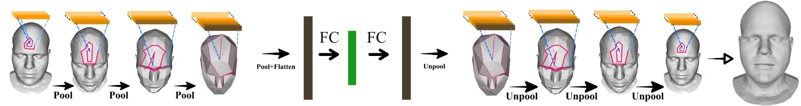

# Neural 3D Morphable Models: Spiral Convolutional Networks for 3D Shape Representation Learning and Generation **Applied to the BU3DFE Dataset**
## Authors: Lorenzo Mandelli, Paula Mihalcea
#### Università degli Studi di Firenze

---

 

**NOTE: This is a copy of the original [Neural3DMM project](https://github.com/gbouritsas/Neural3DMM), modified in order to be applied to the [BU3DFE dataset](http://www.cs.binghamton.edu/~lijun/Research/3DFE/3DFE_Analysis.html) with different data splits.**

The project also contains an implementation of a novel **weighted L1 loss**, which allows the training of the model focused on the most mobile parts of the human face (e.g. nose, mouth, eye contour, chin).

Details about the implementation and the obtained results can be found in the `docs` folder.

---

## Installation

Although the original project came with a `requirements.txt` file and some instructions for installation, they were insufficient for creating a working environment for Python 3 with Conda, especially if the desired package was the `mpi-mesh` package.

For this reason, we have written the following guide for creating a **Conda virtual environment** with **Python 3** called `Neural3DMM_BU3DFE` which can be safely used to execute this repository's code:

1. Create Conda virtual environment:

    ```
    conda create --name Neural3DMM_BU3DFE python=3.6
    conda activate Neural3DMM_BU3DFE
    ```
   
2. Install OpenDR for Python 3:
    ```
    conda install -c anaconda numpy
    git clone https://github.com/apoorvjain25/opendr-1
    pip install opendr-1/.
    rm -r opendr-1 # Or simply manually delete the cloned repo of OpenDR, as it is not needed anymore
    ```

3. Install the [MPI-IS/mesh](https://github.com/MPI-IS/mesh) library:
    ```
    conda install -c anaconda boost
    git clone https://github.com/MPI-IS/mesh
    pip install --upgrade -r mesh/requirements.txt
    pip install --no-deps --install-option="--boost-location=$$BOOST_INCLUDE_DIRS" --verbose --no-cache-dir mesh/.
    rm -r mesh # Or simply manually delete the cloned repo of MPI-IS/mesh, as it is not needed anymore
    ```
    Note: if the second `pip` command should fail, please refer to [this issue](https://github.com/MPI-IS/mesh/pull/58#issuecomment-809244983) (make sure to replace `~/anaconda3/` in the suggested solution with the path to your Anaconda 3 installation, if different).

4. Clone this repository and install its requirements:
    ```
    git clone https://github.com/PaulaMihalcea/Neural3DMM_BU3DFE
    pip install --upgrade -r Neural3DMM_BU3DFE/requirements.txt
    conda install -c pytorch pytorch
    conda install -c conda-forge trimesh
    conda install -c conda-forge tensorboardx
    pip install pyrender
    ```
   
    Note: If during execution TensorboardX should output a serialization error (`__new__() got an unexpected keyword argument 'serialized_options'`), uninstall and then reinstall Protobuf using `pip`:
    ```
    pip uninstall protobuf
    pip install -U protobuf
    ```
   If the program still does not work, or gives out a `RuntimeError: CUDA out of memory. Tried to allocate...` error, try installing version 3.6.0 of Protobuf (ignore `pip`'s warnings about package incompatibility):
    ```
    pip uninstall protobuf
    pip install -U protobuf==3.6.0
    ```

5. Finally, make sure to obtain the [BU3DFE dataset](http://www.cs.binghamton.edu/~lijun/Research/3DFE/3DFE_Analysis.html) from its authors and reorder its models according to the order specified in `data/BU3DFE/identities.txt`, then save it as `dataset.npy` in `data/BU3DFE/`. `dataset.npy` needs to contain only the models' vertices, as their triangulation (which is the same for all models) can be found in `data/BU3DFE/template/template.obj`.

## Usage

In order to run the program for the first time using the default settings (those that yield the best results), simply run `python3 main.py`.
 
Two optional arguments, `--settings` and `--mode`, allow to choose the settings file to be used and the mode (`train` or `test`), e.g.: `python3 main.py --settings my_fav_settings_file --mode train`.

Please note that, unlike the original project, `data_generation.py` does not need to be run anymore if `split_dataset = True` in the chosen settings file. The `settings` folder has been specially created in order to contain any number of settings files, thus allowing for an easier setup of the model.


The following is the original abstract of the project.

---




# Project Abstract 
*Generative models for 3D geometric data arise in many important applications in 3D computer vision and graphics. In this paper, we focus on 3D deformable shapes that share a common topological structure, such as human faces and bodies. Morphable Models and their variants, despite their linear formulation, have been widely used for shape representation, while most of the recently proposed nonlinear approaches resort to intermediate representations, such as 3D voxel grids or 2D views. In this work, we introduce a novel graph convolutional operator, acting directly on the 3D mesh, that explicitly models the inductive bias
of the fixed underlying graph. This is achieved by enforcing consistent local orderings of the vertices of the graph,
through the spiral operator, thus breaking the permutation invariance property that is adopted by all the prior work
on Graph Neural Networks. Our operator comes by construction with desirable properties (anisotropic, topology-aware, lightweight, easy-to-optimise), and by using it as a building block for traditional deep generative architectures, we demonstrate state-of-the-art results on a variety of 3D shape datasets compared to the linear Morphable Model and other graph convolutional operators.* 

[Arxiv link](https://arxiv.org/abs/1905.02876)


# Repository Requirements

This code was written in Pytorch 1.1. We use tensorboardX for the visualisation of the training metrics. We recommend setting up a virtual environment using [Miniconda](https://docs.conda.io/en/latest/miniconda.html). To install Pytorch in a conda environment, simply run 

```
$ conda install pytorch torchvision -c pytorch
```

Then the rest of the requirements can be installed with 

```
$ pip install -r requirements.txt
```

### Mesh Decimation
For the mesh decimation code we use a function from the [COMA repository](https://github.com/anuragranj/coma) (the files **mesh_sampling.py** and **shape_data.py** - previously **facemesh.py** - were taken from the COMA repo and adapted to our needs). In order to decimate your template mesh, you will need the [MPI-Mesh](https://github.com/MPI-IS/mesh) package (a mesh library similar to Trimesh or Open3D).  This package requires Python 2. However once you have cached the generated downsampling and upsampling matrices, it is possible to run the rest of the code with Python 3 as well, if necessary.


# Data Organization

The following is the organization of the dataset directories expected by the code:

* data **root_dir**/
  * **dataset** name/ (eg DFAUST)
    * template
      * template.obj (all of the spiraling and downsampling code is run on the template only once)
      * downsample_method/
        * downsampling_matrices.pkl (created by the code the first time you run it)
    * preprocessed/
      * train.npy (number_meshes, number_vertices, 3) (no Faces because they all share topology)
      * test.npy 
      * points_train/ (created by data_generation.py)
      * points_val/ (created by data_generation.py)
      * points_test/ (created by data_generation.py)
      * paths_train.npy (created by data_generation.py)
      * paths_val.npy (created by data_generation.py)
      * paths_test.npy (created by data_generation.py)

# Usage

#### Data preprocessing 

In order to use a pytorch dataloader for training and testing, we split the data into seperate files by:

```
$ python data_generation.py --root_dir=/path/to/data_root_dir --dataset=DFAUST --num_valid=100
```

#### Training and Testing

For training and testing of the mesh autoencoder, we provide an ipython notebook, which you can run with 

```
$ jupyter notebook neural3dmm.ipynb
```

The first time you run the code, it will check if the downsampling matrices are cached (calculating the downsampling and upsampling matrices takes a few minutes), and then the spirals will be calculated on the template (**spiral_utils.py** file).

In the 2nd cell of the notebook one can specify their directories, hyperparameters (sizes of the filters, optimizer) etc. All this information is stored in a dictionary named _args_ that is used throughout the rest of the code. In order to run the notebook in train or test mode, simply set:

```
args['mode'] = 'train' or 'test'
```

#### Some important notes:
* The code has compatibility with both _mpi-mesh_ and _trimesh_ packages (it can be chosen by setting the _meshpackage_ variable in the first cell of the notebook).
* The reference points parameter needs exactly one vertex index per disconnected component of the mesh. So for DFAUST you only need one, but for COMA which has the eyes as diconnected components, you need a reference point on the head as well as one on each eye.
* **spiral_utils.py**: In order to get the spiral ordering for each neighborhood, the spiraling code works by walking along the triangulation exploiting the fact that the triangles are all listed in a consistent way (either clockwise or counter-clockwise). These are saved as lists (their length depends on the number of hops and number of neighbors), which are then truncated or padded with -1 (index to a dummy vertex) to match all the spiral lengths to a predefined value L (in our case L = mean spiral length + 2 standard deviations of the spiral lengths). These are used by the _SpiralConv_ function in **models.py**, which is the main module of our proposed method.

# Cite

Please consider citing our work if you find it useful:

```
@InProceedings{bouritsas2019neural,
    author = {Bouritsas, Giorgos and Bokhnyak, Sergiy and Ploumpis, Stylianos and Bronstein, Michael and Zafeiriou, Stefanos},
    title = {Neural 3D Morphable Models: Spiral Convolutional Networks for 3D Shape Representation Learning and Generation},
    booktitle   = {The IEEE International Conference on Computer Vision (ICCV)},
    year        = {2019}
}
```
